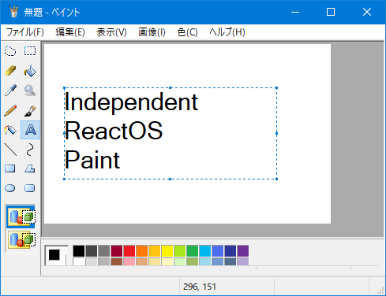

#  Independent ReactOS Paint

This is `"Independent ReactOS Paint"` from [ReactOS](https://reactos.org/).



It's a free and open source software for Windows XP and later.

<p align=center>
  <a href="https://reactos.org/">
    
  </a>
</p>

<p align=center>
  <a href="https://reactos.org/donate/">
    
  </a>
  <a href="https://twitter.com/reactos">
    
  </a>
</p>

## Main code contributors

- Copyright 2009-2015 Benedikt Freisen (b.freisen@gmx.net)
- Copyright 2018 Stanislav Motylkov (x86corez@gmail.com)
- Copyright 2017-2023 Katayama Hirofumi MZ (katayama.hirofumi.mz@gmail.com)
- and more!

## Translators

- Copyright 2009 Artem Reznikov (temarez@yandex.ru)
- Copyright 2009 Benedikt Freisen (b.freisen@gmx.net)
- Copyright 2009 Dmitry Chapyshev (dmitry@reactos.org)
- Copyright 2009 Gabriel Ilardi (gabrielilardi@hotmail.it)
- Copyright 2009 Gábor Balogh (xxxx00) (xxxx_0000@freemail.hu)
- Copyright 2009 Javier Remacha (remialdo@gmail.com)
- Copyright 2009 Lars Martin Hambro (LMH1) (lars_martin4@hotmail.com)
- Copyright 2009 Manuel D V Silva (mds) (manueldulcidio@gmail.com)
- Copyright 2009 Mário Kačmár aka Kario (kario@szm.sk)
- Copyright 2009 Olaf Siejka (caemyr@gmail.com)
- Copyright 2009 Petru Dimitriu (petrimetri@gmail.com)
- Copyright 2009 Sakara Yevhen (eresid@gmail.com)
- Copyright 2009 Wagner Leandro Bueno Angelo (wagner.snake@gmail.com)
- Copyright 2009 Wouter De Vlieger (reFly) (wouterdevlieger@gmail.com)
- Copyright 2009 pcds90net (ds200xnet-ros@yahoo.co.jp)
- Copyright 2009-2010 Paolo Devoti (devotip@tiscali.it)
- Copyright 2009-2010 Radek Liška aka Black_Fox (radekliska@gmail.com)
- Copyright 2009-2010 Tomoya Kitagawa (jptomoya@yahoo.co.jp)
- Copyright 2009-2012 S. Stanev (CCTAHEB) (sstpr@narod.ru)
- Copyright 2010-2011 Igor Paliychuk (mansonigor@gmail.com)
- Copyright 2010-2014 Pierre Schweitzer (pierre@reactos.org)
- Copyright 2011 Elton Chung (elton328@gmail.com)
- Copyright 2011 Kamil Hornicek (kamil.hornicek@reactos.org)
- Copyright 2011 Matheus Macabu (mkbu95@gmail.com)
- Copyright 2011 Michael Wu (Witch) (im.allergic.2.mailing.lists@gmail.com)
- Copyright 2011 Song Fuchang (0xfc) (sfc_0@yahoo.com.cn)
- Copyright 2011-2018 Ștefan Fulea (stefan.fulea@mail.com)
- Copyright 2013 Alexey Gorgurov (leha-bot@ya.ru)
- Copyright 2013 Ardit Dani (ard1t) (ardit.dani@gmail.com)
- Copyright 2013 Yaroslav Denisov (jperm) (jaroslaff111@mail.ru)
- Copyright 2013-2016, 2019 Erdem Ersoy (eersoy93) (erdemersoy@erdemersoy.net)
- Copyright 2013-2018 Baruch Rutman (peterooch@gmail.com)
- Copyright 2014-2015 Henry Tang Ih (henrytang2@hotmail.com)
- Copyright 2014-2016 Ismael Ferreras Morezuelas (swyterzone+ros@gmail.com)
- Copyright 2015 Adam Stachowicz (saibamenppl@gmail.com)
- Copyright 2016 Alexey Shaltsin (BinaryTree) (lexa2011_98@mail.ru)
- Copyright 2016 Sergey Stopkin (stopkin.sergey@gmail.com)
- Copyright 2017 Adam Słaboń (asaillen456esx@gmail.com)
- Copyright 2017 Luke Luo (njlyf2011@hotmail.com)
- Copyright 2017 Markus Gothe (nietzsche@lysator.liu.se)
- Copyright 2018 Joann Mõndresku (joannmondresku@gmail.com)
- Copyright 2018 Nguyễn Thanh Sơn (dummynosrev@gmail.com)
- Copyright 2019 Mas Ahmad Muhammad (m.charly81@gmail.com)
- Copyright 2020 Catalin Gabriel Draghita (catalingabriel.reactos@outlook.com)
- Copyright 2020 Hermès Bélusca-Maïto (hermes.belusca-maito@reactos.org)
- Copyright 2020 Julen Urizar Compains (julenuri@hotmail.com)
- Copyright 2020 Tibor Lajos Füzi (tibor.fuzi@gmail.com)
- Copyright 2020-2022 Katayama Hirofumi MZ (katayama.hirofumi.mz@gmail.com)
- Copyright 2021 Chan Chilung (eason066@gmail.com)
- Copyright 2021 Wu Haotian (rigoligo03@gmail.com)
- Copyright 2021-2022 Süleyman Poyraz (zaryob.dev@gmail.com)
- Copyright 2022 Nikolay Dimitrov (delphipro@gmail.com)
- Copyright 2022-2023 Andrei Miloiu (miloiuandrei@gmail.com)
- Copyright 2023 Jose Carlos Jesus (zecarlos1957@hotmail.com)
- Copyright 2023 Piotr Hetnarowicz (piotrhwz@gmail.com)
- and more!

## How to build?

Please use ReactOS Build Environment (RosBE).

```bash
git clone --recursive https://github.com/katahiromz/RPaint
cd RPaint
cmake -G Ninja -DCMAKE_BUILD_TYPE=Release .
ninja
strip mspaint.exe
```

Tested on RosBE, Visual Studio 2015, and Visual Studio 2019.

## License

- LGPL 2.0 and later
